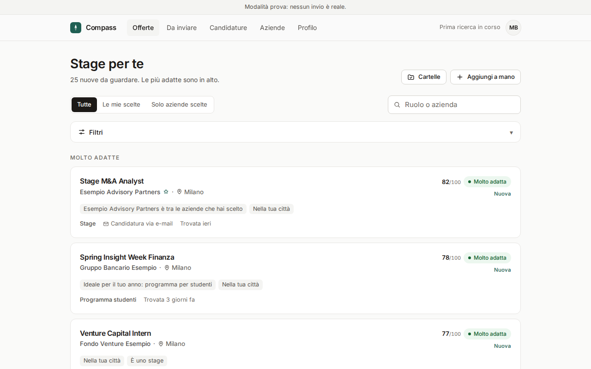
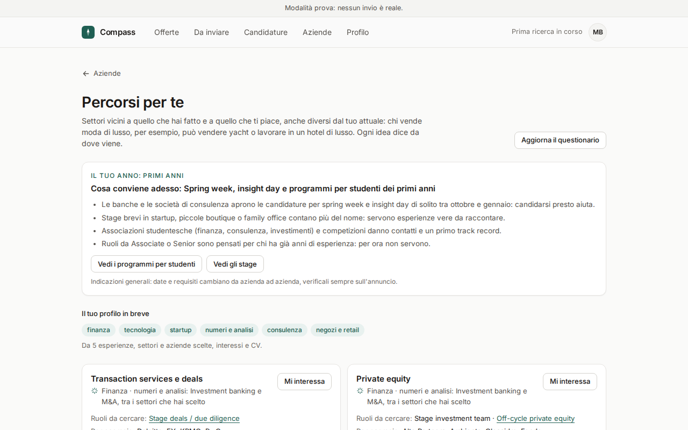
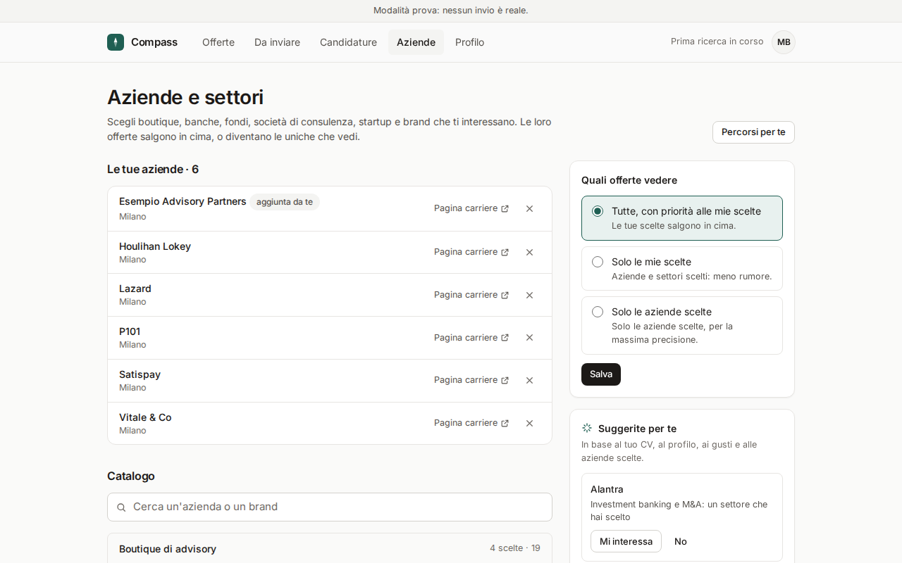
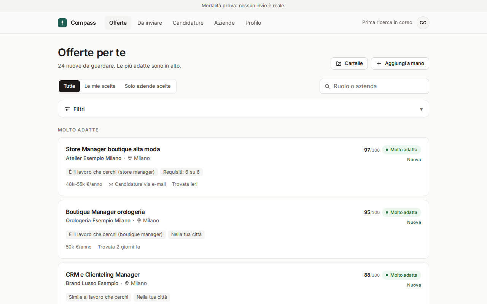
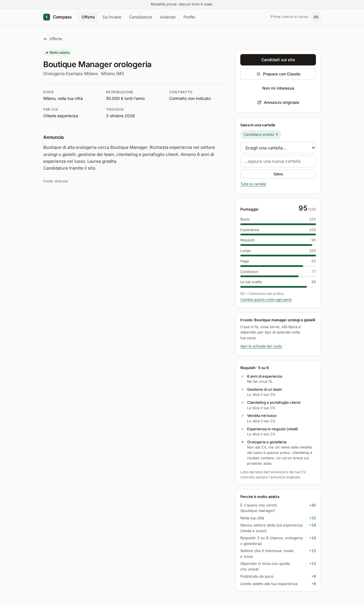
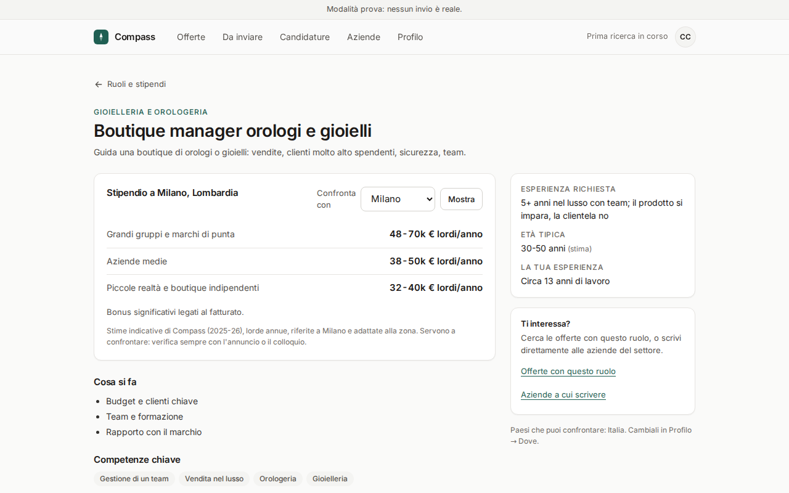
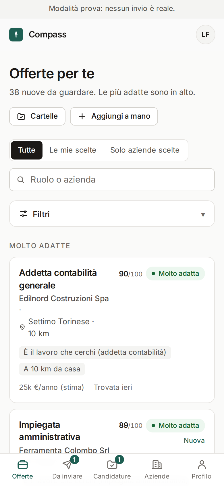
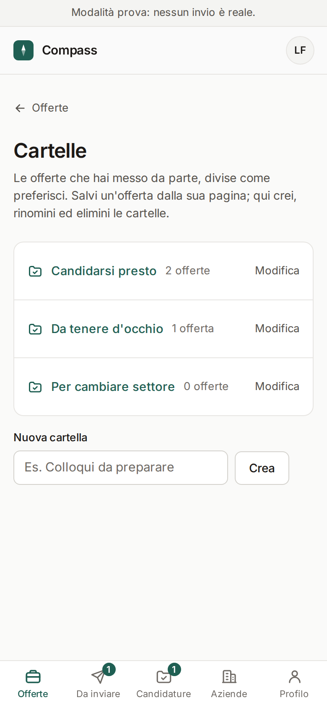
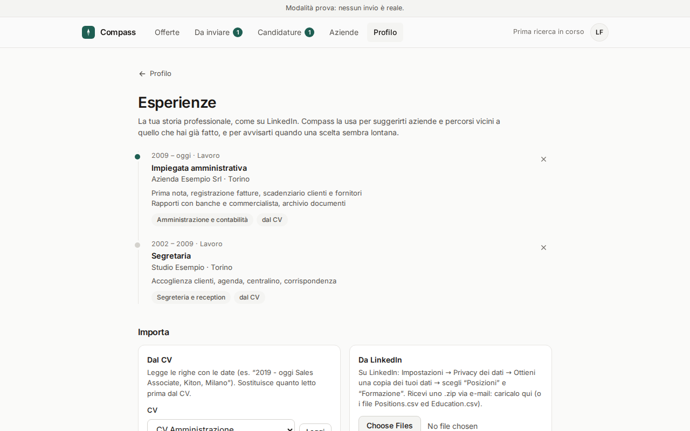
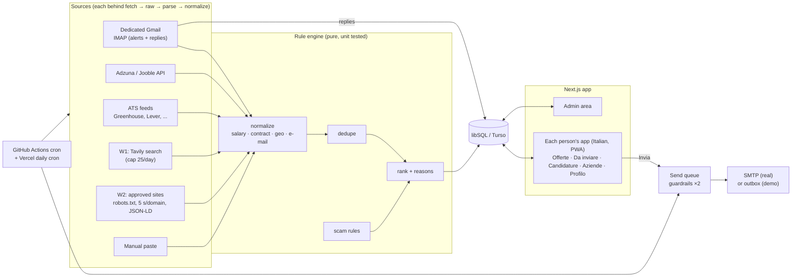

# Compass

**A calm, rule-based job and internship finder for a few people in Italy, the UK, Germany and France.** Compass reads the
job-alert e-mails each person already receives, adds openings from free job APIs, company career
feeds and a capped web search, ranks everything with explainable rules, and helps them apply in a
few taps: by e-mail with strict guardrails, or on the company site with a copy-paste kit.

Each person has their own account and track: **lavoro** (jobs, e.g. an office worker) or
**stage** (internships for university students, ranked by year of study: spring weeks and
insight days in the first years, summer internships in the penultimate year, graduate programmes
in the final year). They choose the boutiques, banks, funds, brands and sectors they care about
from a catalog (or add their own with "Altro"), and Compass suggests nearby careers from their
experience: someone who sold luxury fashion might be shown yachts or luxury hotels.

Plain Italian, a quiet professional design (light and dark), WCAG 2.1 AA, and an "Annulla" on
everything that leaves the house.

| Offers (laptop) | Career paths (student) | Companies and sectors |
|---|---|---|
|  |  |  |

| Score out of 100 (luxury retail) | Requirements and score parts | Role sheet: pay by employer size |
|---|---|---|
|  |  |  |

| Offers (phone) | One offer | Experience timeline |
|---|---|---|
|  |  |  |

## The problem

Looking for work in Italy means LinkedIn, Indeed, InfoJobs, agencies and company sites, each
with its own alerts, duplicates, scams and forms. The person who most needs a clear list is often
the one least comfortable with all of that. For a first-year student the problem is different:
too many "Associate" ads and not enough of the programmes that actually take first-years.
Compass turns both into one short, ranked, explained list and a guided way to apply, without
ever touching anyone's platform accounts.

## What it does

- **Collects** jobs from the alert e-mails forwarded to a dedicated Gmail (LinkedIn, Indeed,
  InfoJobs parsers + a generic fallback), the Adzuna API, public ATS feeds of companies on a
  watchlist (Greenhouse, Lever, Ashby, SmartRecruiters, Workable, Personio), approved career
  sites via schema.org `JobPosting`, a capped official search API (Tavily), and manual paste.
- **Normalizes** Italian salaries (RAL, net monthly, hourly, CCNL levels; estimates labelled),
  contract, hours, remote, languages, distance from home (offline comuni dataset), application
  e-mail with evidence, and **dedupes** across sources keeping every link.
- **Ranks** with named rules into *Molto adatta / Adatta / Poco adatta* plus 1-2 reasons
  ("Nella tua città", "Spring week: adatta al tuo anno", "Lazard è tra le aziende che hai scelto").
  "Non mi interessa" teaches it, visibly and undoably.
- **Accounts**: invitation links or admin-created accounts, each person's data fully separate
  (jobs are shared, scores and statuses are per person; private alerts stay private), an admin
  "open their app" view, optional one mailbox per person.
- **Catalog and focus**: ~180 boutiques, banks, funds, consulting firms, startups and brands, each
  with several sectors and themes (Ferrari is cars, but also luxury and sport). A switch decides
  what you see: everything with your choices first, only your choices, or only your companies.
  Filters (minimum net pay, distance, type, contract...) start from the questionnaire and can be
  saved as your defaults.
- **Four countries, the whole catalog**: optional countries, regions and cities in the
  questionnaire; ~3,100 listed companies and all 1,047 NACE industries (four languages) browsable
  and searchable; ~180 roles searched in each country's language. Searches go only where people
  want to work, best-fitting companies first and the rest in rotation, so free quotas last.
- **Fit score out of 100**: seven readable parts (role, experience, requirements, place, pay,
  conditions, choices), weights you can change, hard limits; each offer lists its requirements
  against your CV with tips for the gaps; role sheets with pay by employer size for your area;
  named folders; a discreet search that never puts your current employer forward.
- **Career panel**: an experience timeline read from the CV (PDF text) or a LinkedIn data export,
  career paths and company suggestions built from shared themes, a gentle "might not be the best
  fit" note when a choice is far from everything else, advice for your year of study, and a
  questionnaire you can redo or edit one step at a time.
- **Applies** in three lanes: (1) e-mail applications she approves with one tap, or an opt-in
  autopilot; (2) "Prepara con Claude": a ready-to-paste prompt for a tailored letter, no AI
  inside the app; (3) a "Kit candidatura" with copy buttons for site forms.
- **Guards** every send: daily cap, Mon-Fri 08:30-18:00, 15-minute undo, no repeats, scam filter,
  blocklist, kill switch, full log, and **demo mode** where nothing leaves the server.
- **Follows up**: detects recruiter replies (thread first, domain fallback), suggests the new
  status, and sends a one-button "Buongiorno!" e-mail every morning.
- **Shows the numbers**: admin metrics (jobs per source, applications per lane, reply rate,
  posting-to-application time).

## Architecture



Code map:

| Path | What |
|---|---|
| `src/lib/core/` | Pure rules: `salary`, `extract`, `geo`, `dedupe`, `rank` (+ `rank-config`), `career-stage`, `timeline`, `scam-rules`, `guardrails`, `templates`, `cv-pick`, `prompt`, `normalize`, `time` |
| `src/lib/catalog/` | The curated catalog (sectors with themes, companies with extra sectors and themes, tastes), positions in four languages, and the mapping of listed companies and NACE codes to it |
| `data/world/` | Generated offline data: towns of UK/DE/FR, NACE codes, listed companies (sources and licences in its README) |
| `src/lib/sources/` | Adapters: `mail/` (IMAP + demo mailbox), `alerts/` (per-template parsers), `api/`, `ats/`, `web/` (W1, robots, polite fetcher, JSON-LD) |
| `src/lib/pipeline/` | Jobs: `ingest`, `discover`, `mailbox-scan`, `digest`, source `health`, `jobs` (runner) |
| `src/lib/server/` | Services, all scoped by person: jobs, applications/queue, replies, profile, settings, auth, accounts, catalog, career, experiences, metrics, privacy |
| `src/app/` | Pages: `(public)` landing, sign-in, sign-up, subscription; `(app)` each person's app; `(setup)` the questionnaire; `admin/` |
| `fixtures/` | Synthetic alert e-mails and HTTP responses used by tests and demo mode |
| `docs/adr/` | Architecture Decision Records |

## Run it

Requirements: Node 20.9+.

```bash
cd compass
cp .env.example .env      # demo mode is the default: nothing ever leaves the machine
npm install
npm run demo              # migrate + seed fake data + start on http://localhost:3000
```

- Job seeker (Lucia, fake): `http://localhost:3000/entra` with `demo@example.com` / `demo-compass`
- Student (Marco, fake, first year): `studente@example.com` / `demo-compass`
- Luxury retail (Chiara, fake, store manager in Milan): `moda@example.com` / `demo-compass`
- Admin: `http://localhost:3000/admin/entra` with `admin@example.com` / `admin-compass`
- Fill the list from the demo sources: admin → Fonti → "Raccogli offerte" (or `npm run job:ingest`).

| Command | |
|---|---|
| `npm run demo` | one-command local start in demo mode |
| `npm run check` | lint + typecheck + unit tests + personal-data scan |
| `npm test` | Vitest: 316 unit and integration tests (rules, parsers, sources, pipeline, guardrails, accounts isolation, catalog, career, countries, fit score, persona, migration) |
| `npm run build && npm run test:e2e` | Playwright: 21 end-to-end flows on a phone viewport (incl. two people, invitations, auth matrix, XSS, axe light and dark) |
| `npm run simulate:week` | a full demo week on a simulated clock, every step checked against the database |
| `npm run audit:ui` | every screen at 360/1280 px, light and dark: axe, text and target sizes, keyboard focus, zoom (needs a running demo) |
| `npm run job:<ingest\|discover\|queue\|replies\|digest>` | run a scheduled job by hand |
| `npm run hooks:install` | install the pre-commit secret/personal-data scan |
| `node scripts/screenshots.mjs` | regenerate the README screenshots from a running demo |
| `node scripts/build-world-data.mjs` | rebuild `data/world/` (towns, NACE, listed companies) from the open datasets |

Going live (real mailbox, real sending, hosting) is described step by step in
[docs/setup.md](docs/setup.md). Day-to-day admin tasks: [docs/guida-admin.md](docs/guida-admin.md).
Her one-page guide (Italian, printable): [docs/come-si-usa.md](docs/come-si-usa.md).
Audit evidence (accessibility report, error states, load test, demo week): [docs/audit/](docs/audit/).

## Legal and ethical design

- **Email alerts first.** The platforms already send alerts; reading a person's own mailbox is the
  least intrusive way to get their listings. **Nobody's LinkedIn, Indeed or InfoJobs account is
  ever touched by code** (the timeline uses the export file LinkedIn lets you download, because
  LinkedIn's API does not give work history to apps like this): no logins, no automation of any "Easy Apply" or ATS form, no account
  creation, no CAPTCHA solving, no proxies, no user-agent tricks.
- **Tiered web discovery.** W1 uses an official search API with a hard daily cap and stores
  only thin records she opens herself. W2 reads only sites the admin approved after reading their
  terms and robots.txt, one request every 5 seconds per domain, cached, conditional GETs, honest
  User-Agent with a contact address, and stops on the first 403/429. W3 (single public platform
  pages) is designed but deliberately not shipped (ADR 0009). No bulk crawling of job platforms.
- **Sending caps.** E-mail applications only where an ad asks for them or a company publishes an
  address for spontaneous applications. Max 10/day (3/day the first week, never above 20),
  working hours only, randomly spaced, one company per 60 days, a 15-minute undo and a kill switch.
- **Scam filter.** Ads asking for money, pushing WhatsApp-only contact, promising unrealistic pay,
  "work from home, earn now", or using a free-mail address unrelated to the company are flagged;
  autopilot never sends them.
- **Honesty.** Templates and the Claude prompt forbid inventing or inflating experience.
- **Privacy.** Each person's data lives only in the database and their mailbox, never in the repo
  or logs, and no one sees another person's CV, applications or private alerts; one click
  deletes everything, and the admin can delete an account. Pay transparency (D.Lgs. 96/2026) is respected by
  treating unknown pay as neutral, never as a reason to hide an ad.

## The subscription page

`/abbonamento` presents Compass as a product with three plans (Essenziale free, Compass
4,90 €/month, Famiglia 8,90 €/month). **The prices are invented** for the portfolio, and the page
says plainly that online payments are not active; no payment provider is integrated.

## Status

MIT licensed. See [CHANGELOG.md](CHANGELOG.md) and the decisions in [docs/adr/](docs/adr/). Parsers were built
against synthetic alert e-mails and are marked "needs real sample" until real (anonymized)
samples are added (see `fixtures/emails/README.md`).

Contains data from GeoNames (CC BY 4.0), Eurostat (NACE Rev. 2.1) and FinanceDatabase (MIT); see `data/world/README.md`.
