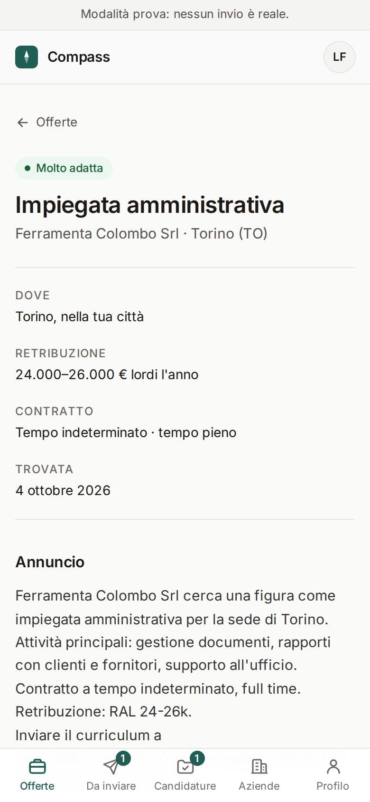
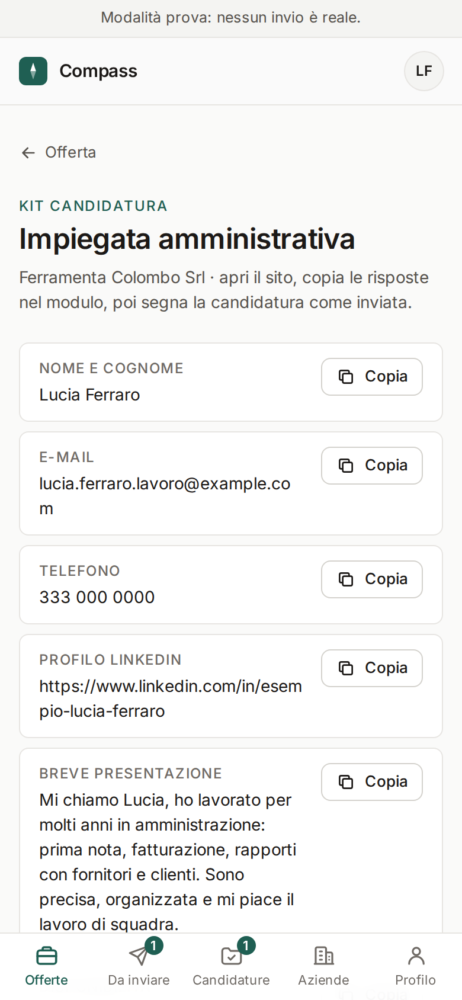
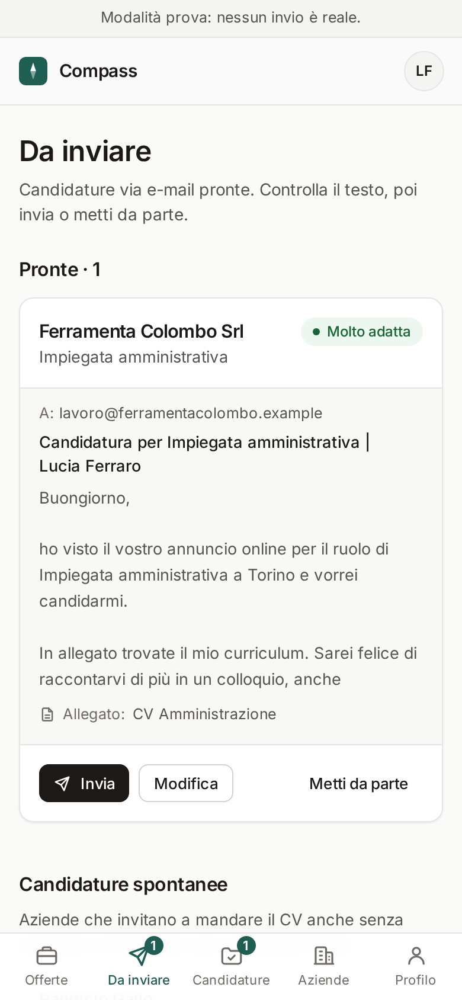
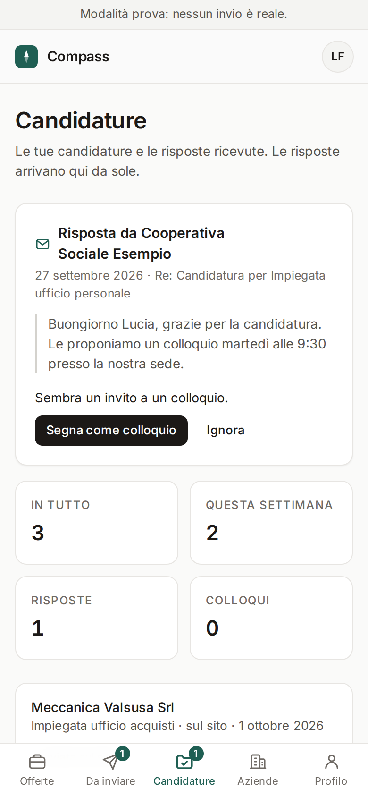

# Come si usa Compass

*Una pagina sola. Stampala e tienila vicino al computer.*

**1. Ogni mattina ti arriva un'e-mail "Buongiorno!"**
Ti dice quante offerte nuove ci sono, quante candidature sono pronte e se qualcuno ti ha risposto.
Premi il pulsante blu **Apri Compass**.

**2. In basso ci sono sempre cinque pulsanti** (sul computer sono in alto)
- **Offerte**: le offerte di lavoro scelte per te.
- **Da inviare**: le candidature via e-mail pronte da mandare.
- **Candidature**: a chi ti sei candidata e chi ti ha risposto.
- **Aziende**: le aziende e i settori che ti interessano, e quelli da evitare.
- **Profilo**: i tuoi dati, i CV, le esperienze, questa guida.

**3. Le offerte**
In alto ci sono quelle **Molto adatte** (etichetta verde). Sotto il titolo leggi perché te le
propongo, per esempio *Nella tua città*. Tocca un'offerta per leggerla tutta.

**4. Ti piace? Ci sono tre modi per candidarti**
- **Prepara candidatura via e-mail**: preparo io l'e-mail con il tuo CV. La trovi in *Da inviare*.
- **Candidati sul sito**: apri il sito dell'annuncio e copi le risposte già pronte con i pulsanti **Copia**.
  Alla fine premi **Ho inviato la candidatura**.
- **Prepara con Claude** (per le offerte migliori): copi un testo, lo incolli nella chat di Claude,
  poi incolli qui la lettera che ti prepara.

**5. Non ti interessa?**
Premi **Non mi interessa** e, se vuoi, dimmi perché. Non te la mostro più e imparo cosa preferisci.

**6. Inviare una candidatura**
In *Da inviare* leggi l'e-mail, poi premi **Invia** e conferma. Parte dopo almeno 15 minuti:
fino ad allora puoi premere **Annulla l'invio**.

**7. Quando qualcuno risponde**
In *Candidature* compare **Risposta da ...** con quello che sembra (per esempio un invito a un
colloquio). Premi il pulsante nero, per esempio **Segna come colloquio**, oppure **Ignora**. L'e-mail completa la leggi nella casella della ricerca di lavoro.

**8. Se qualcosa non va**
Il pulsante rosso **Ferma tutti gli invii** (in *Da inviare*) blocca tutto subito. Non succede niente
di grave: si riattiva con un tocco. Per qualsiasi dubbio, chiedi a chi ti ha preparato Compass.

**Da sapere:** Compass non entra mai nei tuoi account LinkedIn, Indeed o InfoJobs e non manda niente
di nascosto: ogni invio è scritto in *Candidature*.

**In più:** in *Aziende* scegli i nomi che ti interessano (se il tuo manca, usa **Altro**) e decidi
se vedere tutte le offerte con quelle in cima, o solo le tue scelte. In *Profilo → Esperienze* c'è
la tua storia lavorativa letta dal CV: Compass la usa per suggerirti aziende e percorsi vicini.
